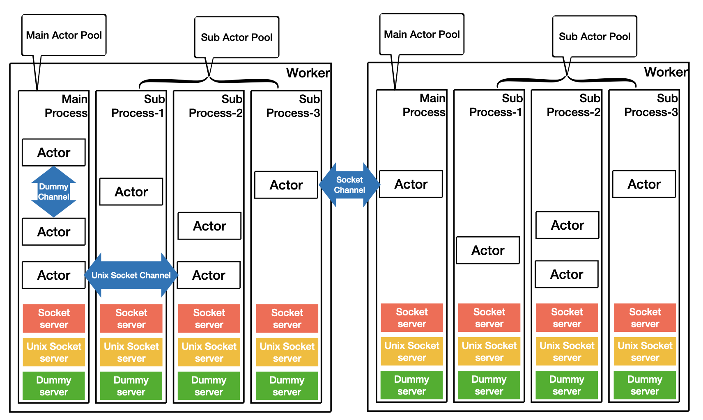
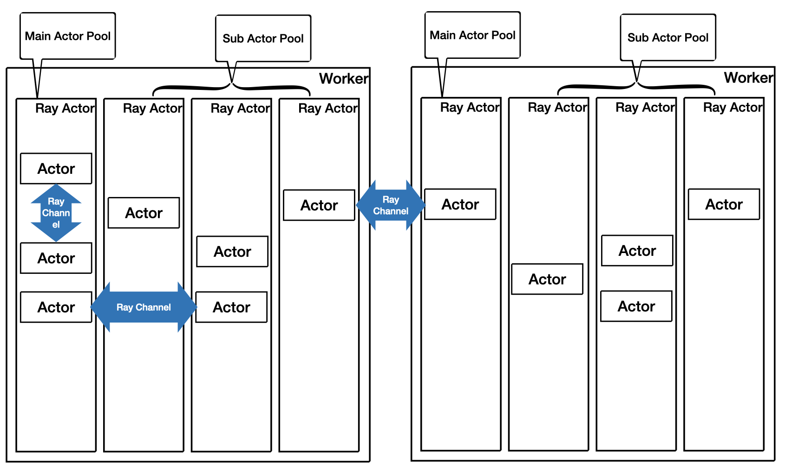

.. _oscar_internals:

Oscar Internal
==============

Oscar supports multiple backends, including Mars itself as well as Ray.

Mars backend
------------

For mars backend, when each worker started, main process and sub processes will be created,
each process owns a event loop. Each process is called actor pool in Mars.

Each actor can talk to another actor without considering if they are in a same process,
or in a same machine, or even on different machines. The underlying communication will
be achieved via an abstraction called channel.

As illustrated in the picuture above, when each process is started,
socket server will be created to accept channel connection
from other workers, unix socket server is created to accept channel connection from other processes,
and dummy server is used to accept channel connection from the same process.
When a message sent from an actor to another actor, the corresponding channel will be used
according to their locations.

Ray backend
-----------

For Ray backend, Mars actor pool is created inside a Ray actor, the channel implemeneted via
Ray call will be used for message passing between Mars actors.

