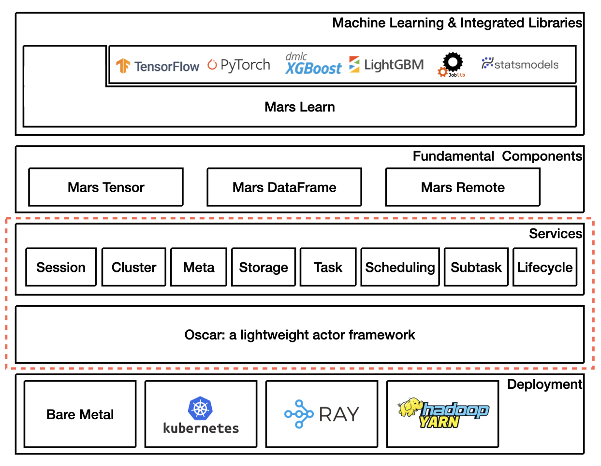

.. _dev_overview:

Architecture
============

Main architecture is shown as below.

This development guide will mainly focus on the part in the ret dot lines.

Mars implements a lightweight actor framework called oscar,
on top of it, the distributed execution layer is decoupled into
a few services includes:

1. Session service. Manage sessions. Each session is isolated,
   the data in one session can not be seen from another session.
2. Cluster service. Monitor entire cluster.
3. Meta service. Store meta of Mars objects, like shape of tensor etc.
4. Storage service. Data can be put and get from storage service,
   functionalities like data spilling and data transfer between workers
   are integrated in storage service as well.
5. Task service. When user called ``.execute()`` method, a task will be
   submitted to this service. Task service will try to tile a high-level
   coarse-grained computational graph into a low-level fine-grained graph
   in which each node in the graph is a subtask. This subtask graph will
   be handed over to scheduling service.
6. Scheduling service. Accept a subtask graph, and schedule the subtasks
   to workers for execution according to many highly optimized scheduling strategies.
7. Subtask service. Accept a subtask, execute them, then put data into storage,
   record meta in meta service, report back result to task service.
8. Lifecycle service. Each Mars objects as well as chunk owns a reference count
   in lifecycle service, when reference count reaches 0, notify storage service to
   remove data, and tell meta service to remove meta.

Code Structure
==============

* core: internal data structures, like tileables, chunks, operands, graphs.
* lib: libraries, e.g. filesystem, sparse.
* oscar: actor framework.
* deploy/oscar: local deploy.
* deploy/kubernetes: deploy on Kubernetes.
* deploy/yarn: deploy on yarn.
* services: all services.
* optimization: high-level and low-level optimization, e.g. fusion.
* serialization: serialization based on pickle5 protocol.
* storage: local storage backends, e.g. plasma, shared_memory, ray.

Tour of Task
============

.. image:: ../images/tour-of-task.gif

A task is consist of the following steps:

1. When `.execute()` called on client side, a task that has a tileable graph
   will be submitted to task service.
2. Task service will optimize tileable graph first, a few rules will be applied,
   e.g. column pruning. Tileable graph will then be tiled into chunk graph,
   chunk graph will be optimized as well, e.g. fusion. Each node on the fused
   chunk graph will be organized as a subtask, the subtask graph will be handed
   over to scheduling service.
3. Scheduling service schedules the subtasks according to a few highly optimized,
   e.g. depth-first, locality-aware, scheduling policies. Subtasks will be submitted
   to subtask service on workers for execution.
4. A task will be finished until all subtasks have been accomplished.
