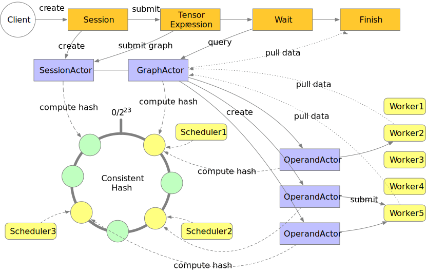

Architecture
============
Mars provides a library for distributed execution of tensors. The distributed
applications are built with actor model provided by ``mars.actors`` and
consists of three parts: the scheduler, the worker and the web service.

Users submit their tasks in graphs built with tensors. The web service accepts
tensor graphs and sends them into a scheduler, where graphs are compiled into
operand graphs, analyzed and partitioned before submitted to workers. The
scheduler then creates and scatters operand actors who control task execution
on workers on other schedulers given consistent hashing. Then operands are
activated and executed in topological order. When all operands related to
terminating tensors are executed, the graph will be marked as finished and the
client can pull the result from workers, proxied by the scheduler. The whole
procedure can be seen in the graph below.

Job Submission
--------------
Jobs are submitted into Mars via RESTful APIs. Users type tensor operations and
run a tensor by calling ``session.run(tensor)``, which builds a tensor graph
given the operations created by the user. This graph is sent to the web api and
a GraphActor is created given consistent hashing in the cluster to handle the
tensor graph. After that the web client begins querying the state of the graph
until termination.

In the GraphActor, we first convert the tensor graph into an operand graph via
tiling methods. This enables the graph to run in parallel. After that, several
analyzes are performed on the graph to obtain operand priorities and assign
workers for the operand, which can be seen in detail in :ref:`graph preparation
<graph_preparation>` and :ref:`scheduling policy <scheduling_policy>` section.
Then OperandActor is created for every operand to control detailed execution.
When an operand is in ``READY`` state, as described in :ref:`operand states
<operand_states>` section, a worker will be selected and the operand is
submitted into the worker for execution.

Execution Control
-----------------
When an operand is submitted to a worker, the OperandActor on the scheduler
listen to its callback. When the execution is successful, successors of that
operand will be scheduled. When the execution failed, the OperandActor will
retry several times before announcing the execution as fatal.

Job Cancellation
----------------
Users can cancel a running job via RESTful API. The request is written into
state storage first and then called in GraphActor. If the graph is under
preparation, it will stop immediately when the stop request is detected in
state storage.  Otherwise every operand is scanned and the states will be set
as ``CANCELLING``.  When the operand is currently running, a stop request will
be sent into workers which results in ``ExecutionInterrupted`` exception in
workers. When this exception is received in OperandActor, the state of the
operand will be marked as ``CANCELLED``.
