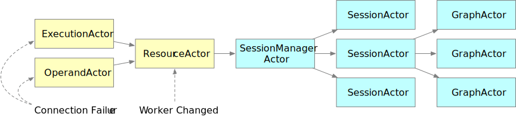

Fault Tolerance
===============

Currently Mars supports two levels of fault tolerance: process-level and
worker-level. Scheduler-level support is not implemented now.

Process-level Fault Tolerance
-----------------------------
Mars uses multiple processes in its worker. When a worker process fails, for
instance, gets killed because of out of memory, and the process is not Process
0 where control actors run, Mars worker will mark relevant tasks as failed,
start another process, restore actors on it and the retry mechanism will
restart the failed task.

Worker-level Fault Tolerance
----------------------------

.. note::

    New in version 0.2.0a3

As Mars uses execution graphs to schedule tasks, when some workers fail,
scheduler will find lost chunks and work out affected operands. After that the
spotted operands are rescheduled.

Failure Notification and Processing
~~~~~~~~~~~~~~~~~~~~~~~~~~~~~~~~~~~
When a worker fails to respond, actors both in other workers and schedulers
will detect it and send a feedback to ResourceActor, where changes in worker
list is accepted and broadcast into all the sessions. When SessionActors accept
the message, they will collect keys of missing data and relay all collected
information to running GraphActors, where fail-over decisions are actually
made.

The failure notification procedure is illustrated in the graph below.

When accepting a fail-over call, a GraphActor will first try reassigning states
of affected operands, reassigning initial workers for initial operands, and
then send updates to corresponding OperandActors to rerun these operands.

Reassigning States
~~~~~~~~~~~~~~~~~~
When some workers fail, data stored in these workers are lost. Therefore we
need to change the states of these operands in order to run them again. As is
stated in :ref:`operand states <operand_states>`, data generated by an operand
only exist when operands are in ``FINISHED`` state, we perform a two-pass
scanning procedure to calculate new assignments for operands:

1. Scan all FINISHED operands whose data are lost and mark them and their
   successors as affected;
2. Scan the graph from bottom to top, starting from affected operands;
3. For every affected operand, we scan its predecessors. If the data of the
   predecessor is lost or in a state without data or generating data, for
   instance, ``FREED`` or ``UNSCHEDULED``, the predecessor will be marked as
   affected;
4. Mark current operand as ``READY`` when no predecessors are affected,
   otherwise it will be marked as ``UNSCHEDULED``;
5. When there are no affected operands to be scanned, stop, otherwise go to
   Step 2.

Reassigning Initial Workers
~~~~~~~~~~~~~~~~~~~~~~~~~~~
When workers fail, some of initial operands assigned in :ref:`graph preparation
<graph_preparation>` step may not have workers to execute on. What's more,
change in number of workers may lead to imbalance in worker assignments. We
solve this problem by applying an adaptive worker reassigning strategy. The
algorithm framework is similar with the original one except that we do not
visit initial operands which are executed, and the stop criterion of visiting
operands in Step 3 is now limited to the average number of operands per worker
minus the number of operands already executed or determined to run in the
candidate worker.
