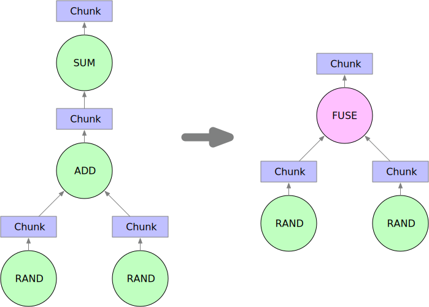

.. _graph_preparation:

Graph Preparation
=================
When a tensor graph is submitted into Mars scheduler, a graph comprises of
operands and chunks will be generated given ``chunks`` parameters passed in
data sources.

Graph Compose
-------------
After tiling a tensor graph into a chunk graph, we will combine adjacent nodes
to reduce graph size as well as to utilize acceleration libraries such as
``numexpr``. Currently Mars only merges operands that forms a single chain
without branches. For example, when executing code

.. code-block:: python

    import mars.tensor as mt
    a = mt.random.rand(100, chunks=100)
    b = mt.random.rand(100, chunks=100)
    c = (a + b).sum()

Mars will compose operand ADD and SUM into one FUSE node. RAND operands are
excluded because they don't form a line with ADD and SUM.

Initial Worker Assignment
-------------------------
Assigning operands to workers are crucial to the performance of graph
execution. Random worker assignment will contribute to huge network cost and
imbalanced workload between different workers. Since the workers of non-initial
operands can be effectively decided given data distribution and cluster
idleness, we only assign workers for initial nodes in graph preparation stage.

Initial worker assignment should obey several principles. First, the number of
operands assigned to each worker should be balanced. This makes full use of the
cluster especially in the late stage of graph execution. Secondly, operand
assignment should minify the amount of network transfer in its descendants.
That is, locality need to be observed in the assignment process.

Note that these principles sometimes collides with each other. That is, a
network-minimal solution may be quite biased. We developed a heuristic
algorithm in practice that takes a balance between minimal network transfer and
worker load balance. The algorithm is described below:

1. Select the first worker who does not have any operands;
2. Start breadth-first search on the undirected graph produced from the operand
   graph;
3. When an initial operand is visited, we assign it to the worker we selected
   in Step 1;
4. Stop assignment when the number of operands visited is greater than the
   average number of operands for every worker;
5. Go to Step 1 when there are workers left.
