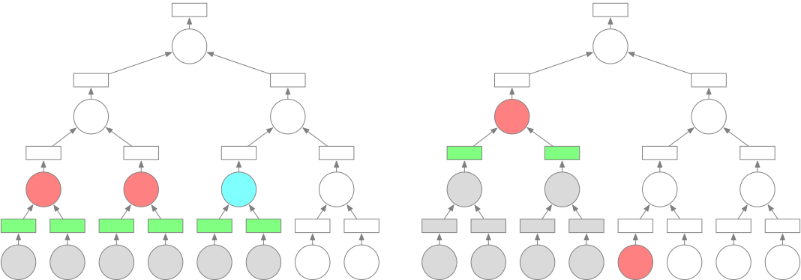

.. _scheduling_policy:

Scheduling Policy
=================
When an operand graph is being executed, proper selection of execution order
will reduce total amount of data stored in the cluster, thus reducing the
probability that chunks are spilled into disks. Proper selection of workers can
also reduce the amount of data needed to transfer in execution.

Operand Selection
-----------------
Proper execution order can significantly reduce the number of objects stored in
the cluster.  We show the example of tree reduction in the graph below, where
ovals represent operands and rectangles represent chunks. Red color means that
the operand is being executed, and blue color means that the operand is ready
for execution. Green color means that the chunk is stored, while the gray color
means that chunks or operands are freed. Assume that we have 2 workers, and
work load of all operands are the same. Both graphs show one operand selection
strategy that is executed after 5 time unit. The left graph show the scenario
when nodes are executed in hierarchical order, while the right show that the
graph is executed in depth-first order. The strategy on the left graph leaves 6
chunks stored in the cluster, while the right only 2.

Given that our goal is to reduce the amount of data stored in the cluster
during execution, we put a priority for operands when they are ready for
execution:

1. The operand with greater depth shall be executed earlier;
2. The operand required by deeper operands shall be executed earlier;
3. The operand with smaller output size shall be executed first.

Worker Selection
----------------
The worker of initial operands are decided when the scheduler prepares an
operand graph.  We choose the worker of descendant operands given the location
of input chunks. When there are multiple workers providing minimal network
transfer, a worker satisfying resource requirements are selected.
