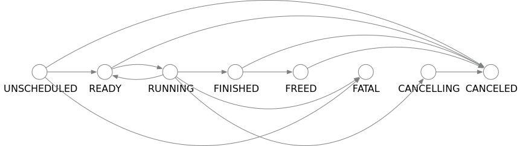

.. _operand_states:

Operand States
==============
Every operand in Mars is scheduled independently by an OperandActor. The
execution is designed as a state transition process. We assign a state handling
function for every state to control the execution procedure. Every operand is
at ``UNSCHEDULED`` state when the actor is initially initialized. When certain
conditions are met, the operand switches into another state and perform
corresponding actions. If an operand is recovered from KV store, its state when
scheduler crashes will be loaded and the state is resumed. The state transition
graph can be shown below:

We illustrate the meaning of every state and actions Mars take when entering
these states.

* ``UNSCHEDUED``: the operand is in this state when it is not ready to execute.
* ``READY``: the operand is in this state when all input chunks are ready. When
  this state is entered, the OperandActor submits the operand to all workers
  selected in AssignerActor. If the operand is about to run in one of the
  selected workers, it will respond to the scheduler and the scheduler suspends
  the operand on other workers and start executing the operand on the
  requesting worker.
* ``RUNNING``: the operand is in this state when it is assigned to a worker or
  already started execution. When this state is entered, the OperandActor
  checks if it has been submitted to the worker. If not submitted, the operand
  is built into an "executable dag" containing FetchChunks. Then a callback is
  registered in the worker to handle execution finish.
* ``FINISHED``: the operand is in this state when the operand finishes
  execution. When this state is entered, a terminal operand will send a
  notification to its GraphActor to decide if the whole graph finishes
  execution. What's more, the OperandActor looks for precedent and successor
  chunks and notify them. When a predecessor receives the notification, it
  checks if all its successors finishes execution. If so, the data of that
  operand can be freed. When a successor receives the notification, it checks
  if all of its predecessors are finished. If so, the operand itself can move
  to ``READY``.
* ``FREED``: the operand is in this state when all data related to this operand
  is freed.
* ``FATAL``: the operand is in this state when itself or some predecessor
  failed to execute.  When this state is entered, the OperandActor try to pass
  this state down to its successors.
* ``CANCELLING``: the operand is in this state when it is being cancelled. If
  the operand is previously running, a cancel request will be sent to the
  worker.
* ``CANCELLED``: the operand is in this state when it is cancelled and stops
  running. When this state is entered, the OperandActor tries to switch its
  descendants into ``CANCELLING``.
