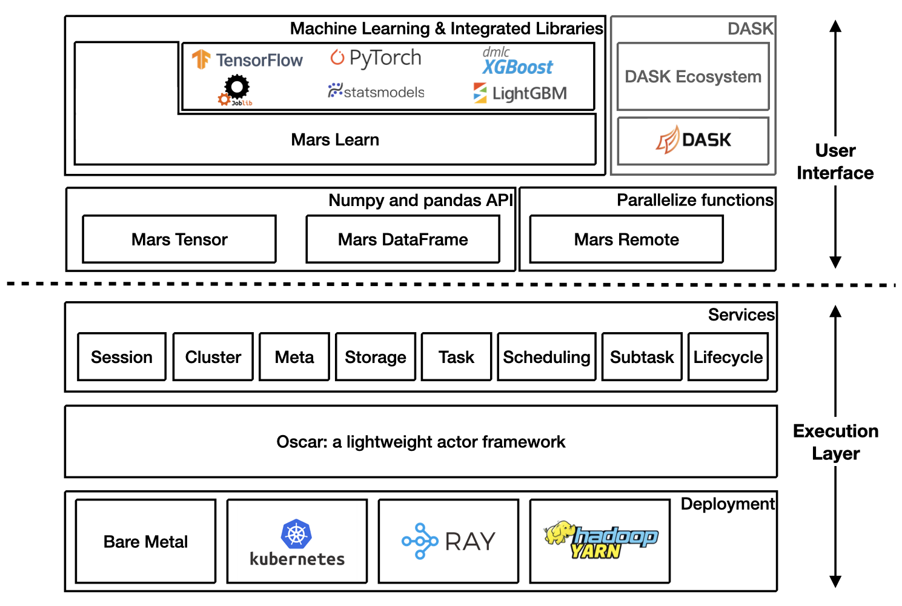

.. _index:

==================
Mars Documentation
==================

Mars is a tensor-based unified framework for large-scale data computation
which scales numpy, pandas, scikit-learn and many other libraries.

Architecture Overview
---------------------

Getting Started
---------------

Starting a new runtime locally via:

.. code-block:: python

    >>> import mars
    >>> mars.new_session()

Or connecting to a Mars cluster which is already initialized.

.. code-block:: python

    >>> import mars
    >>> mars.new_session('http://<web_ip>:<ui_port>')

Mars tensor
-----------

:doc:`documentation <getting_started/tensor>`

Mars tensor provides a familiar interface like Numpy.

+-----------------------------------------------+-----------------------------------------------+
| **Numpy**                                     | **Mars tensor**                               |
+-----------------------------------------------+-----------------------------------------------+
|.. code-block:: python                         |.. code-block:: python                         |
|                                               |                                               |
|    import numpy as np                         |    import mars.tensor as mt                   |
|    N = 200_000_000                            |    N = 200_000_000                            |
|    a = np.random.uniform(-1, 1, size=(N, 2))  |    a = mt.random.uniform(-1, 1, size=(N, 2))  |
|    print((np.linalg.norm(a, axis=1) < 1)      |    print(((mt.linalg.norm(a, axis=1) < 1)     |
|          .sum() * 4 / N)                      |            .sum() * 4 / N).execute())         |
|                                               |                                               |
+-----------------------------------------------+-----------------------------------------------+
|.. code-block::                                |.. code-block::                                |
|                                               |                                               |
|    3.14174502                                 |     3.14161908                                |
|    CPU times: user 11.6 s, sys: 8.22 s,       |     CPU times: user 966 ms, sys: 544 ms,      |
|               total: 19.9 s                   |                total: 1.51 s                  |
|    Wall time: 22.5 s                          |     Wall time: 3.77 s                         |
|                                               |                                               |
+-----------------------------------------------+-----------------------------------------------+

Mars can leverage multiple cores, even on a laptop, and could be even faster for a distributed setting.

Mars dataframe
--------------

:doc:`documentation <getting_started/dataframe>`

Mars DataFrame provides a familiar interface like pandas.

+-----------------------------------------+-----------------------------------------+
| **Pandas**                              | **Mars DataFrame**                      |
+-----------------------------------------+-----------------------------------------+
|.. code-block:: python                   |.. code-block:: python                   |
|                                         |                                         |
|    import numpy as np                   |    import mars.tensor as mt             |
|    import pandas as pd                  |    import mars.dataframe as md          |
|    df = pd.DataFrame(                   |    df = md.DataFrame(                   |
|        np.random.rand(100000000, 4),    |        mt.random.rand(100000000, 4),    |
|        columns=list('abcd'))            |        columns=list('abcd'))            |
|    print(df.sum())                      |    print(df.sum().execute())            |
|                                         |                                         |
+-----------------------------------------+-----------------------------------------+
|.. code-block::                          |.. code-block::                          |
|                                         |                                         |
|    CPU times: user 10.9 s, sys: 2.69 s, |    CPU times: user 1.21 s, sys: 212 ms, |
|               total: 13.6 s             |               total: 1.42 s             |
|    Wall time: 11 s                      |    Wall time: 2.75 s                    |
+-----------------------------------------+-----------------------------------------+

Mars learn
----------

:doc:`documentation <getting_started/learn>`

Mars learn provides a familiar interface like scikit-learn.

+---------------------------------------------+----------------------------------------------------+
| **Scikit-learn**                            | **Mars learn**                                     |
+---------------------------------------------+----------------------------------------------------+
|.. code-block:: python                       |.. code-block:: python                              |
|                                             |                                                    |
|    from sklearn.datasets import make_blobs  |    from mars.learn.datasets import make_blobs      |
|    from sklearn.decomposition import PCA    |    from mars.learn.decomposition import PCA        |
|    X, y = make_blobs(                       |    X, y = make_blobs(                              |
|        n_samples=100000000, n_features=3,   |        n_samples=100000000, n_features=3,          |
|        centers=[[3, 3, 3], [0, 0, 0],       |        centers=[[3, 3, 3], [0, 0, 0],              |
|                 [1, 1, 1], [2, 2, 2]],      |                  [1, 1, 1], [2, 2, 2]],            |
|        cluster_std=[0.2, 0.1, 0.2, 0.2],    |        cluster_std=[0.2, 0.1, 0.2, 0.2],           |
|        random_state=9)                      |        random_state=9)                             |
|    pca = PCA(n_components=3)                |    pca = PCA(n_components=3)                       |
|    pca.fit(X)                               |    pca.fit(X)                                      |
|    print(pca.explained_variance_ratio_)     |    print(pca.explained_variance_ratio_)            |
|    print(pca.explained_variance_)           |    print(pca.explained_variance_)                  |
|                                             |                                                    |
+---------------------------------------------+----------------------------------------------------+

Mars learn also integrates with many libraries:

- :ref:`TensorFlow <integrate_tensorflow>`
- :ref:`PyTorch <integrate_pytorch>`
- :ref:`XGBoost <integrate_xgboost>`
- :ref:`LightGBM <integrate_lightgbm>`
- :ref:`Joblib <integrate_joblib>`
- :ref:`Statsmodels <integrate_statsmodels>`

Mars remote
-----------

:doc:`documentation <getting_started/remote>`

Mars remote allows users to execute functions in parallel.

+-------------------------------------------+--------------------------------------------+
|.. code-block:: python                     |.. code-block:: python                      |
|                                           |                                            |
|    import numpy as np                     |    import numpy as np                      |
|                                           |    import mars.remote as mr                |
|                                           |                                            |
|    def calc_chunk(n, i):                  |    def calc_chunk(n, i):                   |
|        rs = np.random.RandomState(i)      |        rs = np.random.RandomState(i)       |
|        a = rs.uniform(-1, 1, size=(n, 2)) |        a = rs.uniform(-1, 1, size=(n, 2))  |
|        d = np.linalg.norm(a, axis=1)      |        d = np.linalg.norm(a, axis=1)       |
|        return (d < 1).sum()               |        return (d < 1).sum()                |
|                                           |                                            |
|    def calc_pi(fs, N):                    |    def calc_pi(fs, N):                     |
|        return sum(fs) * 4 / N             |        return sum(fs) * 4 / N              |
|                                           |                                            |
|    N = 200_000_000                        |    N = 200_000_000                         |
|    n = 10_000_000                         |    n = 10_000_000                          |
|                                           |                                            |
|    fs = [calc_chunk(n, i)                 |    fs = [mr.spawn(calc_chunk, args=(n, i)) |
|          for i in range(N // n)]          |          for i in range(N // n)]           |
|    pi = calc_pi(fs, N)                    |    pi = mr.spawn(calc_pi, args=(fs, N))    |
|    print(pi)                              |    print(pi.execute().fetch())             |
|                                           |                                            |
+-------------------------------------------+--------------------------------------------+
|.. code-block::                            |.. code-block::                             |
|                                           |                                            |
|    3.1416312                              |    3.1416312                               |
|    CPU times: user 32.2 s, sys: 4.86 s,   |    CPU times: user 616 ms, sys: 307 ms,    |
|               total: 37.1 s               |               total: 923 ms                |
|    Wall time: 12.4 s                      |    Wall time: 3.99 s                       |
|                                           |                                            |
+-------------------------------------------+--------------------------------------------+

DASK on Mars
------------

Refer to :ref:`DASK on Mars <integrate_dask>`.

Mars on Ray
------------

Refer to :ref:`Mars on Ray <mars_ray>`.

Easy to scale in and scale out
------------------------------

Mars can scale in to a single machine, and scale out to a cluster with hundreds of machines.
Both the local and distributed version share the same piece of code,
it's fairly simple to migrate from a single machine to a cluster
to process more data or gain a better performance.

Mars can run in a few ways:

- :ref:`Local scheduling <local>`
- :ref:`Run on cluster <deploy>`
- :ref:`Run on Ray <mars_ray>`
- :ref:`Run on Kubernetes <k8s>`
- :ref:`Run on Yarn <mars_yarn>`

.. toctree::
   :maxdepth: 2
   :hidden:

   installation/index
   getting_started/index
   user_guide/index
   reference/index
   development/index
